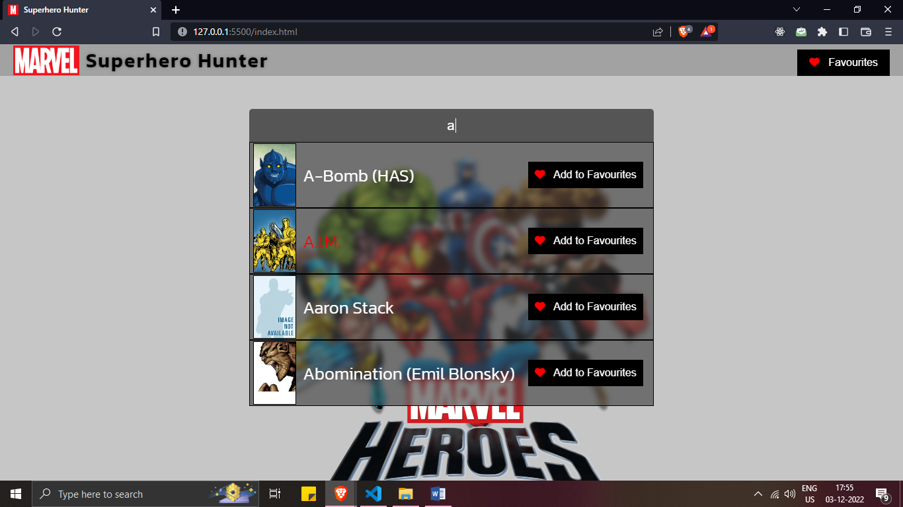
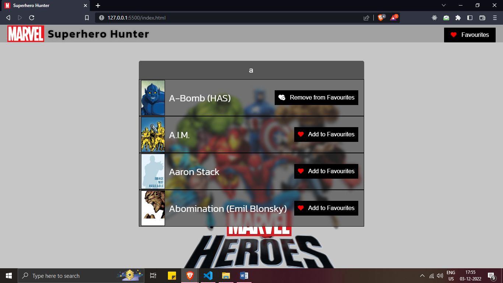
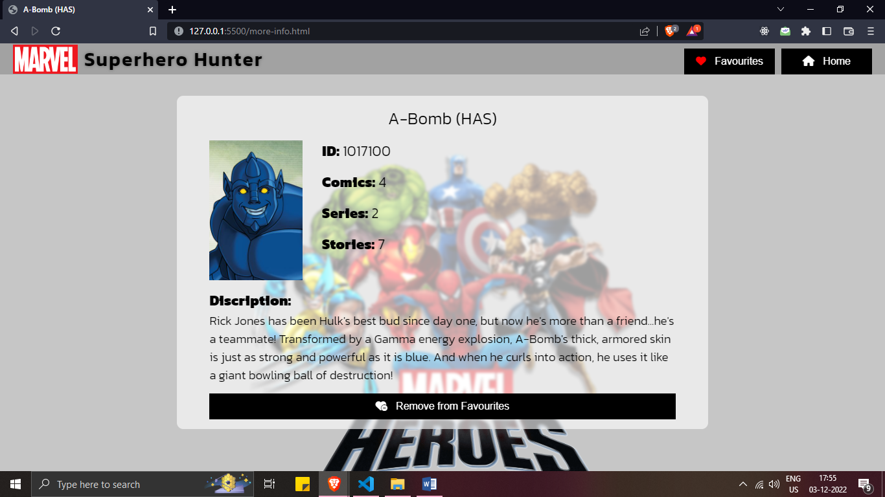

# Superhero Hunter JS

A great website built using HTML, CSS and Vanilla JavaScript, utilizing the power of MARVEL API which allows to search and get useful insights about your favourite superhero. Also you can add your favourite characters easily (using Web storage i.e. localStorage).

Features & Flow
Home Page Home page has a searchbar to type the name of superhero that you wish to know about. It shows the matching characters as you type just like google does. Simply click on the matching results to know more about that character.

Super Hero Information Page This page shows the details of the character like comics, events, series and a lot of information. There is also an option to add/remove character to/from favourites.

Favourite Page Here you will be able to see all the characters and details which you have marked as favourite. Also there's a button to remove a character from favourite by clicking on the favourite icon.

## Hosted Link

[https://superherohunterapp.netlify.app/](https://superherohunterapp.netlify.app/)

## Authors

- [@RutvijPatel](https://www.github.com/rutvij-fsd)

## Screenshots

